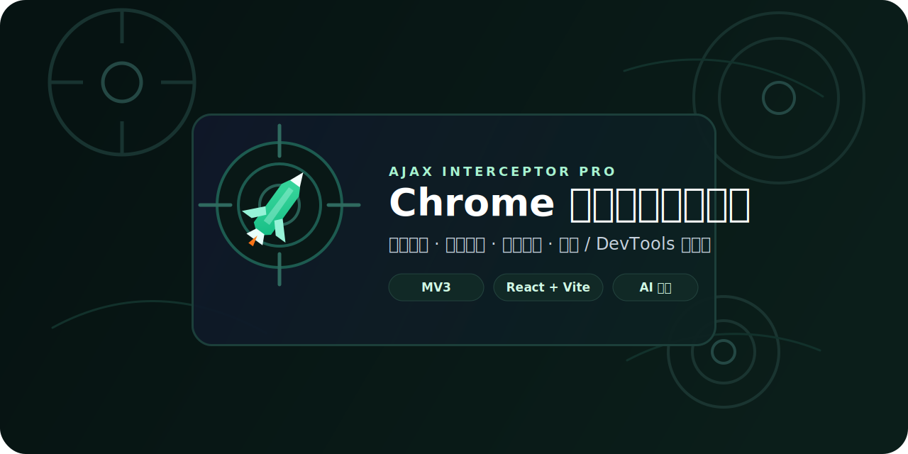
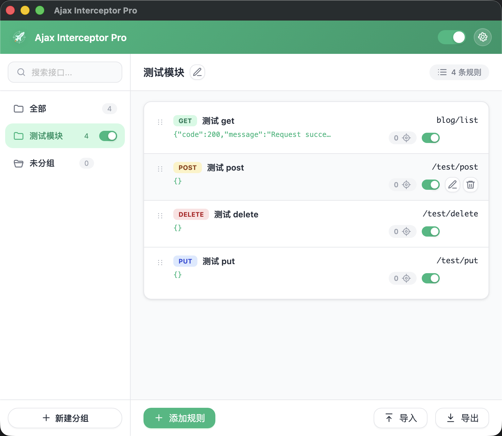
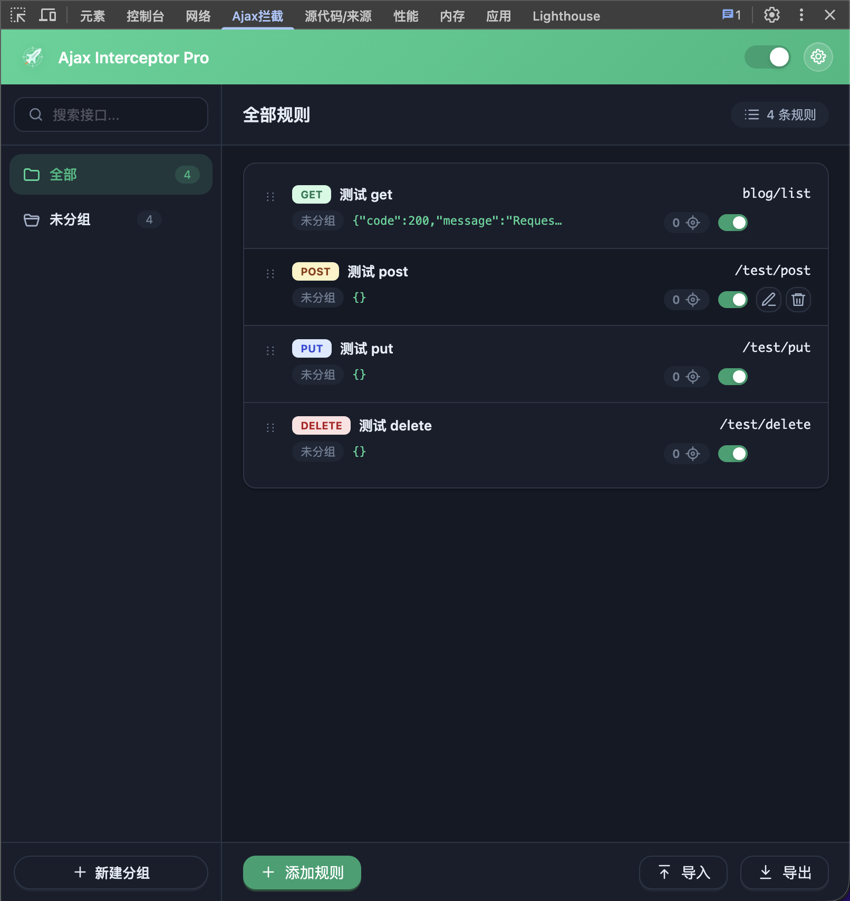

<div align="center">
  
</div>

<h1 align="center">Ajax Interceptor Pro</h1>

<p align="center">
  基于 <a href="https://github.com/YGYOOO/ajax-interceptor">Ajax Interceptor</a> 演进而来的 Chrome 接口拦截插件。
  <br />
  为前端调试、联调、自测和接口模拟提供一套更完整、更顺手的工作台。
</p>

<p align="center">
  <a href="https://github.com/lululuting/Ajax-Interceptor-Pro"></a>
  
  
  
  
</p>

<p align="center">
  <a href="#特性">特性</a> ·
  <a href="#快速开始">快速开始</a> ·
  <a href="./USAGE.md">使用说明</a> ·
  <a href="#项目结构">项目结构</a>
</p>

## 项目简介

Ajax Interceptor Pro 保留了接口拦截这个核心能力，同时把规则管理、导入导出、命中统计和界面交互补得更完整，更适合日常前端开发、联调和调试使用。

项目基于 GPT-5.4 的 AI 协作开发实践，仓库中现在看到的界面、交互和大部分功能，都是在持续对话、生成、调整与打磨中逐步完成的。

## 界面预览

<table>
  <tr>
    <td width="50%">
      
    </td>
    <td width="50%">
      
    </td>
  </tr>
  <tr>
    <td align="center">小窗模式 · 浅色主题</td>
    <td align="center">DevTools 模式 · 暗色主题</td>
  </tr>
</table>

## 特性

| 功能 | 说明 |
| --- | --- |
| 请求拦截 | 支持拦截 `XMLHttpRequest` 和 `fetch` |
| 规则管理 | 支持分组、拖拽排序、跨组移动 |
| 调试反馈 | 支持命中计数、开关状态、规则查看 |
| 数据流转 | 支持规则导入、导出、合并、覆盖 |
| 使用模式 | 支持弹窗模式与 DevTools 模式切换 |
| 开发体验 | React + Ant Design 构建，界面更完整易用 |

## 适合的场景

- 本地没有后端时，先模拟接口返回
- 联调前，用固定响应快速自测页面
- 复现异常状态、错误码或特殊返回结构
- 临时接管某些请求，验证前端逻辑是否正确
- 用分组隔离不同项目、不同环境、不同调试任务

## 快速开始

默认仓库里的 `dist/` 已经构建完成，可以直接加载到 Chrome 开箱即用；只有在你需要二次开发、修改界面或调整功能时，才需要安装依赖并重新构建。

### 1. 安装依赖

```bash
npm install
```

### 2. 构建插件

```bash
npm run build
```

### 3. 开发模式

如果你希望边改边构建，可以使用：

```bash
npm run dev
```

### 4. 加载到 Chrome

1. 打开 Chrome 扩展管理页
2. 开启“开发者模式”
3. 点击“加载已解压的扩展程序”
4. 选择项目里的 `dist/` 目录

## 使用说明

详细使用方式见 [USAGE.md](./USAGE.md)。

## 技术栈

- React
- Ant Design
- Vite
- Chrome Extension Manifest V3

## 项目结构

```text
background/   后台 Service Worker
content/      页面注入与请求拦截逻辑
docs/         README 相关资源
icons/        插件图标资源
libs/         Monaco 与共享前端脚本
popup/        弹窗静态资源
src/          React 源码
tests/        Node 测试
```

## 项目地址

- GitHub: https://github.com/lululuting/Ajax-Interceptor-Pro
- 原始扩展参考: https://github.com/YGYOOO/ajax-interceptor

## 说明

本项目当前定位为开发调试工具，请仅在你可控、合法且明确知道影响范围的页面和环境中使用。
